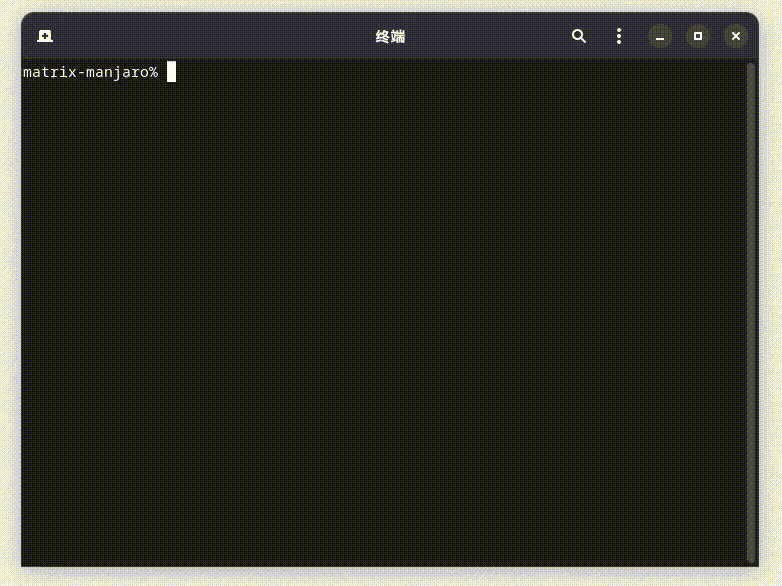
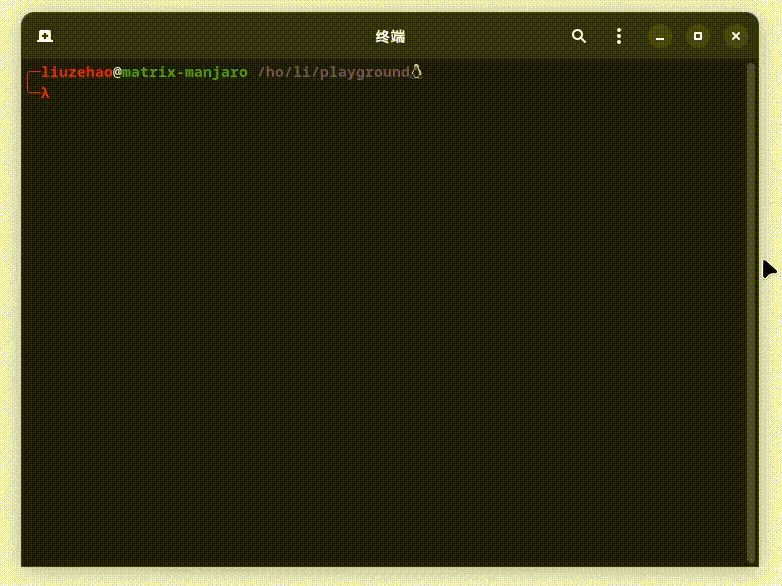
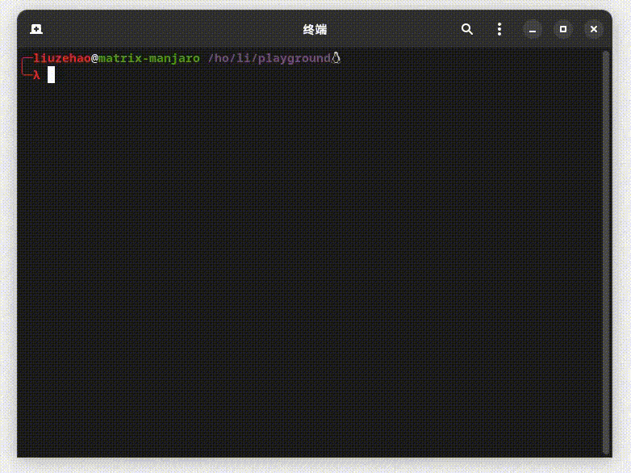
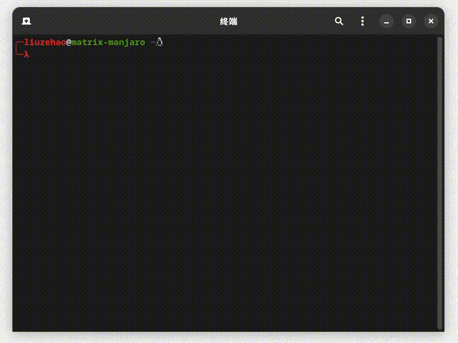
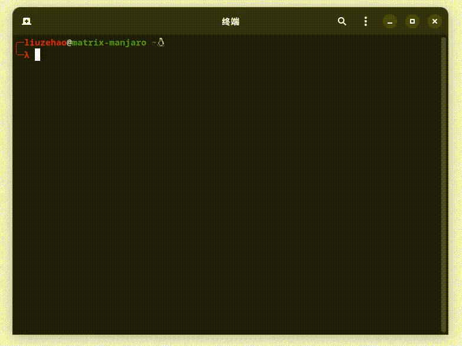

<center><h3>abws (A Bash With Suggestions)A shell toy (maybe not a toy, it's up to you) with suggested functionality implemented entirely in bash script.</h3></center>

[中文README](./README_zh.md)

### About
This is a script that uses a bash script to implement similar functionality to the `zsh-autosuggestions` plugin. To implement the suggested functionality, I implemented some of the kernel-provided line editor commands (just to provide basic functionality).
Here is the implemented readline command.

### Requirement

`Bash` version 4.4+

### KayMaps

| keymap shortcut | command |
| :---: | :---: |
| Ctrl-a | **beginning-of-line** |
| Ctrl-b | **backward-char** |
| Ctrl-d | **delete-char** |
| Ctrl-e | **end-of-line** `or` **accept_suggestion** |
| Ctrl-f | **forward-char** |
| Ctrl-k | **kill-line-to-end** |
| Ctrl-n | **next-history** |
| Ctrl-p | **previous-history** |
| Ctrl-u | **kill-line-to-start** |
| Ctrl-w | **backward-kill-word** |
| Ctrl-l | **clear_screen** |
| Ctrl-i `or` Tab | **expand-or-complete** |
| Alt+d | **forward-kill-word** |
| Alt+b | **backward-word** |
| Alt+f | **forward-word** |
| Up | **lastcmd** |
| Down | **nextcmd** |
| Right | **cursor_right** `or` **accept_suggestion** |
| Left | **cursor_left** |
| **typing chars** | **self-insert** |

Note: `Ctrl-c` Call the trap function `on_sig_int` and use the `exit` command to exit the program.

### Implemented functions

**Auto Suggestions**

  

**Completion**

  - directory completion

    

  - file completion

    

**Previous Command Status Acquisition**

  

**Dynamic Prompt**

  

**Basic Unicode Support**

  

### Possible uses
1. A little reference for those who want to implement custom suggestion function.
2. This program can be used as a frontend application, for example to provide complementary functionality for mysql or redis client commands.
3. ...

### Examples

**As redis-cli with complementary functions**

You can use the redirect feature since bash 2.04 to create tcp or udp connections.

```bash
#!/bin/bash

# A redis service has been started locally
# Create file descriptors that can be read and written
exec 3<> /dev/tcp/localhost/6379

r() {
  local response=""
  while read -rn 1 -t 0.1 input || [[ -n $input ]]
  do
    response+="$input"
  done <&3
  echo -e "$response"
}

w () {
  read -p "cmd: "
  echo "$REPLY" >&3
}

while :
do
  w
  r
done
```
Just a possible idea is provided here. Similar functionality can be integrated into the current program, which can provide suggested actions for the command line.

### Things that come to mind that are not currently completed and may need to be completed.
- [ ] more tests
- [ ] bind command output shortcut key binding
- [ ] Multi-line input processing
- [ ] Complementary fully automatic formatting of output
- [ ] syntax highlighting
- [ ] Optimize code: **Improve buffer processing rate** ( `deletekey` function is particularly slow in current implementation )
- [ ] add reserved words to support some custom syntax
- [ ] implement more shortcut keys

---

Since this script is not well tested, so if there are any bugs or ideas about the program you can submit pr or discuss them together🤗.
