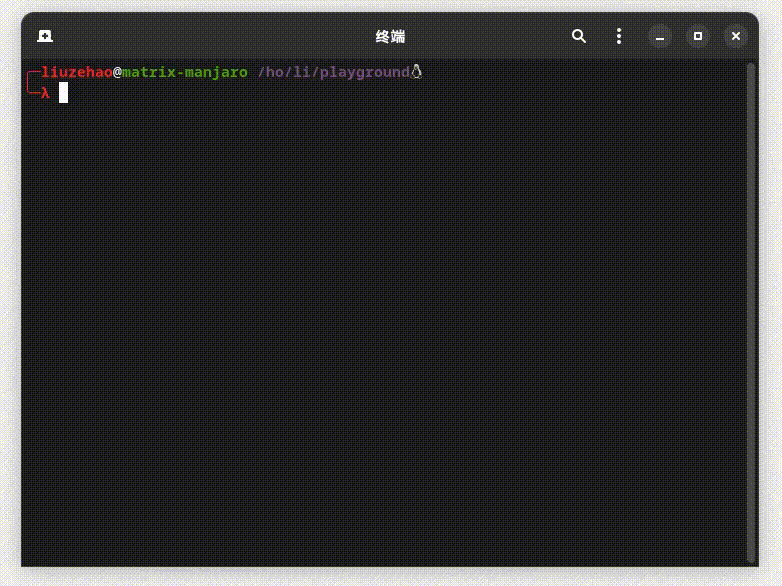
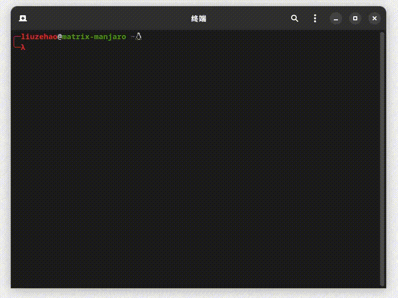
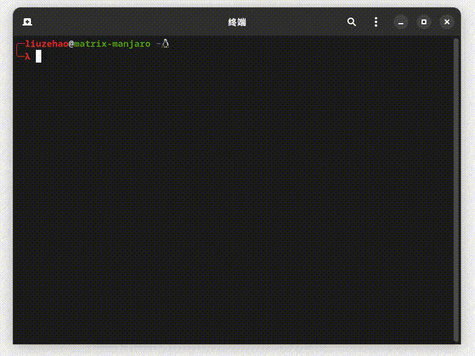

<center><h3>abws (拥有建议功能的bash)完全使用bash实现的具有建议功能的shell玩具(是不是玩具取决于你)</h3></center>

[英文README](./README.md)

### About
这是一个使用bash脚本实现，类似 `zsh-autosuggestions` 插件功能的脚本，为了实现建议功能，我顺便实现了一些内核提供的行编辑器的命令(只是提供基础功能)。
下面是实现了的readline command

### 运行bash版本需要

`Bash` 版本 4.4+

### 快捷键

| keymap shortcut | command |
| :---: | :---: |
| Ctrl-a | **beginning-of-line** |
| Ctrl-b | **backward-char** |
| Ctrl-d | **delete-char** |
| Ctrl-e | **end-of-line** `or` **accept_suggestion** |
| Ctrl-f | **forward-char** |
| Ctrl-k | **kill-line-to-end** |
| Ctrl-n | **next-history** |
| Ctrl-p | **previous-history** |
| Ctrl-u | **kill-line-to-start** |
| Ctrl-w | **backward-kill-word** |
| Ctrl-l | **clear_screen** |
| Ctrl-i `or` Tab | **expand-or-complete** |
| Alt+d | **forward-kill-word** |
| Alt+b | **backward-word** |
| Alt+f | **forward-word** |
| Up | **lastcmd** |
| Down | **nextcmd** |
| Right | **cursor_right** `or` **accept_suggestion** |
| Left | **cursor_left** |
| **typing chars** | **self-insert** |

Note: `Ctrl-c` 调用trap函数`on_sig_int`，使用 `exit` 命令退出程序。

### 已实现功能

**自动建议**

  

**补全**

  - 文件夹补全

    

  - 普通文件补全

    

**上一个命令状态获取**

  

**动态的Prompt**

  

**基本Unicode支持**

  

### 可能的用途
1. 给实现自定义建议功能一点参考
2. 这个程序可以作为一个前台应用，比如为mysql或者redis的客户端命令提供补全功能。
3. ...

### 示例

**作为redis-cli的补充功能**

可以使用自bash 2.04版本之后的重定向功能来创建tcp或者udp连接。

```bash
#!/bin/bash

# 已经在本地启动了一个redis服务
# 创建可以读写的文件描述符
exec 3<> /dev/tcp/localhost/6379

r() {
  local response=""
  while read -rn 1 -t 0.1 input || [[ -n $input ]]
  do
    response+="$input"
  done <&3
  echo -e "$response"
}

w () {
  read -p "cmd: "
  echo "$REPLY" >&3
}

while :
do
  w
  r
done
```
这里只是提供一个可行的思路。可以将类似的功能集成进当前程序，可以为命令行提供建议操作。

### 目前想到的没有完成，可能需要完成的事情。

- [ ] 或许更多测试
- [ ] bind命令输出快捷键绑定
- [ ] 多行输入处理
- [ ] 补全自动格式化输出
- [ ] 语法高亮
- [ ] 优化代码: **提高buffer处理速率**( `deletekey` 函数当前实现尤其慢)
- [ ] 添加保留字支持一些自定义语法
- [ ] 实现更多快捷键功能

---
由于这个脚本并没有很好地被测试，所以如果程序有什么bug或者对程序有什么想法可以提交pr或者一起讨论🤗。
